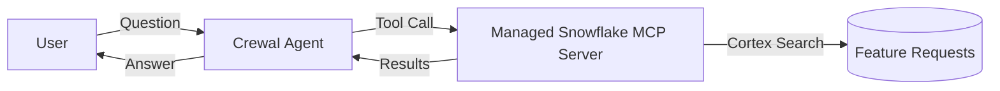
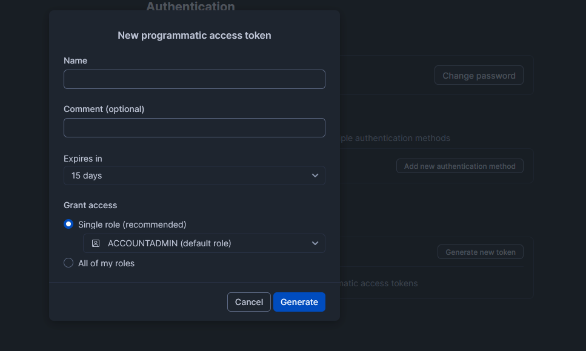
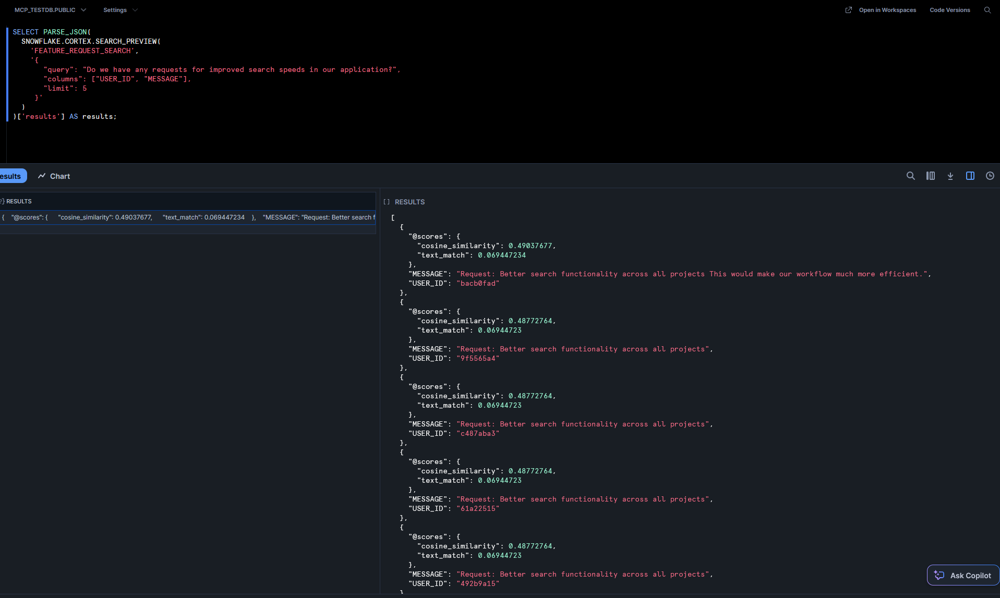
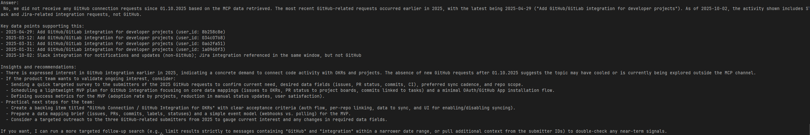
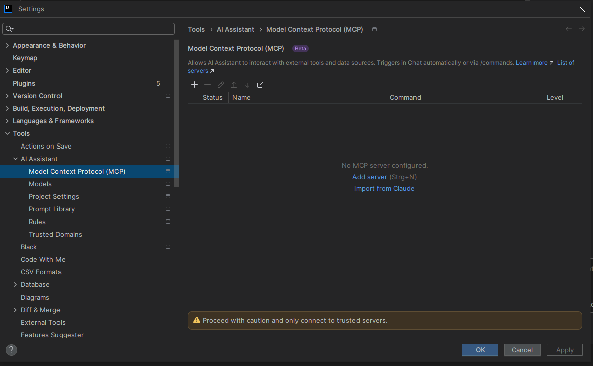

# Snowflake Managed MCP

A demonstration project showcasing Snowflake's Managed Model Context Protocol (MCP) server functionality for secure data agents and AI-powered search capabilities.

## Table of Contents

- [Overview](#overview)
- [Prerequisites](#prerequisites)
- [Resources](#resources)
- [Setup Instructions](#setup-instructions)
- [Testing](#testing)
  - [Test the Snowflake Search Service](#test-the-snowflake-search-service)
  - [Test the MCP Server Connection](#test-the-mcp-server-connection)
- [Expected Output](#expected-output)

## Overview

This project demonstrates how to set up and use Snowflake's Managed MCP servers to create secure data agents that can perform intelligent searches over your data using natural language queries. The example includes setting up a feature request search service powered by Snowflake Cortex Search.

### Architecture



At a high level, the CrewAI agent invokes a tool that calls the Snowflake Managed MCP Server over HTTPS using a Programmatic Access Token (PAT). The MCP server executes a Cortex Search Service over your feature request data and returns results back to the agent.

## Prerequisites

> **⚠️ IMPORTANT NOTICE**
> 
> This example assumes that the user has `ACCOUNTADMIN` privileges to create the necessary services and network policies. 
> **Running the SQL migrations will alter the NETWORK POLICY at the account level to allow access from all IP addresses!**
> 
> Please ensure you understand the implications before proceeding in a production environment.

## Resources

- **Release Blog Article**: [Managed MCP Servers - Secure Data Agents](https://www.snowflake.com/en/blog/managed-mcp-servers-secure-data-agents/)
- **Quick Start Guide**: [Getting Started with Snowflake MCP Server](https://quickstarts.snowflake.com/guide/getting-started-with-snowflake-mcp-server/index.html#1)

## Setup Instructions

### Environment variables
Create a `.env` file by copying `.env.template` and fill in the following variables:

- `APP__SF__SQL_ALCHEMY_CONN` — SQLAlchemy connection string to your Snowflake account (includes account identifier, database, and schema).
- `APP__SF__ACCESS_TOKEN` — Programmatic Access Token (PAT) generated in Snowflake UI.
- `APP__OPENAI_KEY` — OpenAI API key for the example CrewAI agent.

To generate a personal access token (PAT) for Snowflake, head over to the Snowflake UI and into your
account settings > authentication > programmatic access tokens. Generate a new token:



### Database Migrations
All required objects are created using alembic revisions. 
This is helpful as this keeps the original
SQL queries which you would run on Snowflake itself without any abstraction layer above like Terraform.
To roll out everything make sure your environment variables are set and run

```bash
alembic upgrade head
```
This will run the database migrations to create the necessary tables containing test data,
search services, and MCP server configuration.

In detail it will:
- Create an example table for feature requests
- Populate it with sample test data
- Set up the Cortex Search service
- Configure the MCP server
- Apply necessary network policies

## Testing

### Test the Snowflake Search Service

Once the setup is complete, you can test the Cortex Search functionality directly in Snowflake using the following SQL query:

```sql
SELECT PARSE_JSON(
  SNOWFLAKE.CORTEX.SEARCH_PREVIEW(
    'feature_request_search',
    '{
       "query": "Do we have any requests for improved search speeds in our application?",
       "columns": ["USER_ID", "MESSAGE", "CREATED_AT"],
       "limit": 5
     }'
  )
)['results'] AS results;
```



### Test the MCP Server Connection

To verify that the MCP server is properly configured and responsive, run the test script:

  ```bash
  sh .\test_mcp.sh
  ```

## Expected Output

If everything is configured correctly, you should see output similar to the following JSON response:

```json
{
  "jsonrpc": "2.0",
  "id": 12345,
  "result": {
    "tools": [
      {
        "name": "User Feature Request Search Service",
        "description": "A tool that performs keyword and vector search over user feature requests for our application.",
        "title": "Feature Requests",
        "inputSchema": {
          "type": "object",
          "description": "A search query and additional parameters for search.",
          "properties": {
            "query": {
              "description": "Unstructured text query.",
              "type": "string"
            },
            "columns": {
              "description": "List of columns to return.",
              "type": "array",
              "items": {
                "type": "string"
              }
            },
            "filter": {
              "description": "Filter query. Cortex Search supports filtering on the ATTRIBUTES columns specified in the CREATE CORTEX SEARCH SERVICE command.\n\nCortex Search supports four matching operators:\n1. TEXT or NUMERIC equality: @eq\n2. ARRAY contains: @contains\n3. NUMERIC or DATE/TIMESTAMP greater than or equal to: @gte\n4. NUMERIC or DATE/TIMESTAMP less than or equal to: @lte\n\nThese matching operators can be composed with various logical operators:\n- @and\n- @or\n- @not\n\nThe following usage notes apply:\nMatching against NaN ('not a number') values in the source query are handled as described in Special values. Fixed-point numeric values with more than 19 digits (not including leading zeroes) do not work with @eq, @gte, or @lte and will not be returned by these operators (although they could still be returned by the overall query with the use of @not).\n\nTIMESTAMP and DATE filters accept values of the form: YYYY-MM-DD and, for timezone aware dates: YYYY-MM-DD+HH:MM. If the timezone offset is not specified, the date is interpreted in UTC.\n\nThese operators can be combined into a single filter object.\n\nExample:\nFiltering on rows where NUMERIC column numeric_col is between 10.5 and 12.5 (inclusive):\n{\n  \"@and\": [\n    { \"@gte\": { \"numeric_col\": 10.5 } },\n    { \"@lte\": { \"numeric_col\": 12.5 } }\n  ]\n}",
              "type": "object"
            },
            "limit": {
              "description": "Max number of results to return.",
              "type": "integer",
              "default": 10
            }
          },
          "required": ["query"]
        }
      }
    ]
  }
}
```

When you see this response, it confirms that the MCP server is properly configured and ready to handle requests.

## Using the MCP Server

### Programmatically
This repository contains a Python script that demonstrates how to use the MCP server programmatically using the CrewAI
package.

Run the agent to answer you question using the following command:
```sh
python .\run_agent.py
```
Make sure to have a OpenAI API key set in the environment variables as this is needed for the agent to work.
You can use this example question if you like:

`Can you show me examples of user requests looking for new integrations for other services? Summarize the services for me.`

`Did we receive any requests to add a gitHub connection since 01.10.2025?`




### IntelliJ IDEA

Add the following configuration
```json
{
  "mcpServers": {
    "snowflake": {
      "command": "C:\\Program Files\\nodejs\\npx.cmd",
      "args": [
        "-y",
        "mcp-remote@latest",
        "https://<ACCOUNT-IDENTIFIER>.snowflakecomputing.com/api/v2/databases/<DATABASE>/schemas/<SCHEMA>/mcp-servers/MCP_SERVER",
        "--header",
        "Authorization: Bearer <SNOWFLAKE_PAT>"
      ]
    }
  }
}
```
Sadly, Snowflake only provides a protocol version which is not supported by mcp-remote and also 
doesn't do any version negotiations yet.

### ChatGPT
Don't bother for now if you want to keep your sanity.

### Claude
Needs a paid version.

### Cursor
```json
{
    "mcpServers": {
      "snowflake": {
        "url": "https://<ACCOUNT-IDENTIFIER>.snowflakecomputing.com/api/v2/databases/<DATABASE>/schemas/<SCHEMA>/mcp-servers/MCP_SERVER",
            "headers": {
              "Authorization": "Bearer <SNOWFLAKE_PAT>"
            }
      }
    }
}
```